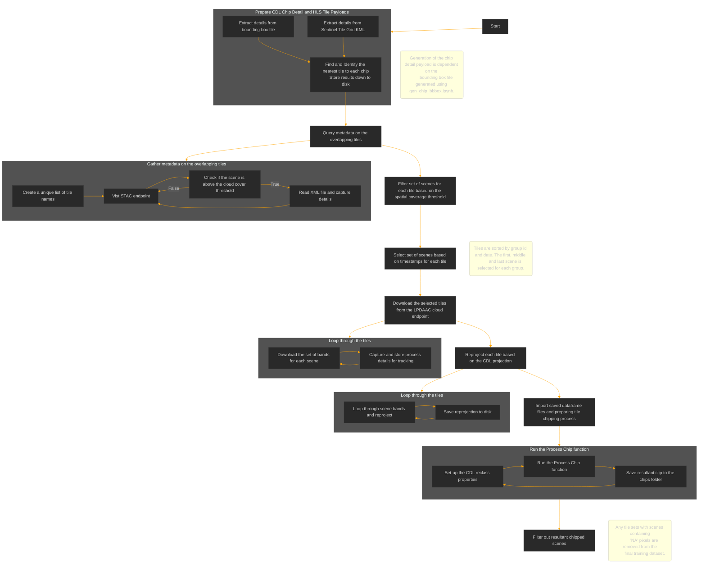

# Steps to Reproduce Training Data

## Introduction

The data generation pipeline is a multi-step process that involves identifying, determining, downloading and processing HLS scenes. The final output of the processed HLS scenes is used as the input for running the for the multi-temporal crop classification model.

### Process Outline

The steps for generating the training data are as follows:

1. Specify an area of interest (AOI) representing a region for which training data will be generated*
2. Prepare CDL chips and identify intersecting HLS scenes that correspond to each chip
3. Determine candidate scenes that meet cloud cover and spatial coverage criteria
4. Select and download scenes from IPFS
5. Reproject each tile based on the CDL projection
6. Merge scene bands and clip to chip boundaries
7. Discard clipped results that do not meet QA and NA criteria

### Crop Classification `data_prep` module

The prior [workflow](https://github.com/ClarkCGA/multi-temporal-crop-classification-training-data/blob/main/workflow.ipynb) was self contained within a Jupyter notebook, but has been refactored into a more [modular](../crop_classification/data_prep) and reusable format. The process outlined above is now broken down into a series of scripts that can be run independently or as a whole.

1. [prepare_async.py](./crop_classification/data_prep/prepare_async.py) - This script prepares the CDL chips and identifies intersecting HLS scenes that correspond to each chip. The output of this script is a CSV file containing the HLS scenes that intersect with each CDL chip.
2. [ADD DOWNLOAD SCRIPT] - This script downloads the HLS scenes from IPFS based on the CSV file generated in the previous step.
3. [reproject.py](./crop_classification/data_prep/reproject.py) - This script reprojects scene based on the CDL projection.
4. [process_chips.py](./crop_classification/data_prep/process_chips.py) - This script merges scene bands and clips to chip boundaries. It also discards clipped results that do not meet QA and NA criteria.

### Data Prerequisites

The required source files to download are:

* [2022 National Cropland Data Layer (CDL)](https://www.nass.usda.gov/Research_and_Science/Cropland/Release/)
* Harmonized Landsat-Sentinel (HLS) imagery
  * Sourced from Earthdata to be prepared with [Singularity](https://data-programs.gitbook.io/singularity) and onboard to Filecoin and IPFS
* [Sentinel-2 Tile Grid](https://sentiwiki.copernicus.eu/__attachments/1692737/S2A_OPER_GIP_TILPAR_MPC__20151209T095117_V20150622T000000_21000101T000000_B00.zip) - Details on the tile grid for Sentinel-2 can be found [here](https://sentiwiki.copernicus.eu/web/s2-products).

## Dataset Summary

Each HLS scene requires the following spectral bands in a GeoTIFF format.

1. Blue
2. Green
3. Red
4. Narrow NIR
5. SWIR 1
6. SWIR 2

HLS scenes are clipped to match the bounding box of the CDL chips, covering a 224 x 224 pixel area at 30m spatial resolution The scenes are then merged into a single GeoTIFF, containing 18 bands for three time steps, where each time step represents three observations throughout the growing season. Each GeoTIFF is accompanied with a mask, containing one band with the target classes for each pixel.

> The processed HLS scenes are saved to the directory `./data/download/<training dataset name>`, where `<training dataset name>` represents the value passed into `train_dataset_name` property in the configuration file.

### Band Order

In each input GeoTIFF the following bands are repeated three times for three observations throughout the growing season: Channel, Name, HLS S30 Band number
>
    Channel, Name,   HLSS30 Band number
    1,       Blue,   B02
    2,       Green,  B03
    3,       Red,    B04
    4,       NIR,    B8A
    5,       SW 1,   B11
    6,       SW 2,   B12
>

Masks are a single band with values:
> 0 : "No Data" 1 : "Natural Vegetation" 2 : "Forest" 3 : "Corn" 4 : "Soybeans" 5 : "Wetlands" 6 : "Developed/Barren" 7 : "Open Water" 8 : "Winter Wheat" 9 : "Alfalfa" 10 : "Fallow/Idle Cropland" 11 : "Cotton" 12 : "Sorghum" 13 : "Other"

### Data Splits

The 3,854 chips have been randomly split into training (80%) and validation (20%) with corresponding ids recorded in cvs files `train_data.txt` and `validation_data.txt`.

## Detailed Explanation of the Pipeline Process

## Prepare CDL Chip Detail Payloads

This payload contains the details about the chip information that will be used to identify corresponding tiles. This information is derived from the `chips_id.json` file to generate the following dataframe:

* Chip ID
* Chip X centroid coordinate
* Chip Y centroid coordinate
* Tile Name

## Prepare HLS Tile Spatial Context

This payload contains the spatial context about the Sentinel scene tiles in `sentinel_tile_grid.kml`.  The information derived is:

* Tile Name
* Tile X centroid coordinate
* Tile Y centroid coordinate
* Tile bounding box

## Find and Identify the nearest tile to each chip

Loop each chip and identify closest tile by the xy centroid. The chip payload dataframe is modified with tile information and is saved to file for reuse later.

## Query metadata on the overlapping tiles

Here, we need to capture and store metadata details all scenes for a given tile that are above a specific cloud cover threshold. This information comes from a xml metadata file found at [this STAC instance endpoint](https://cmr.earthdata.nasa.gov/stac/LPCLOUD).

1. Create a unique list of tile names that are captured in the chip payload dataframe.
2. Vist STAC endpoint and loop through each tile in the list and check if the scene is above the cloud cover threshold
   1. If true, read in the XML file and capture the following details:
      * Tile ID
      * Cloud Cover
      * Scene Date
      * Spatial Coverage
      * HTTP & S3 links for the bands `B02`, `B03`, `B04`, `B8A`, `B11`, `B12` and `fmask`
3. Save scene results down as tile payload dataframe to file for reuse later.

## Filter the tile metadata based on the spatial coverage threshold

Here we identify scenes that meet our criteria of:

1. Cloud cover of 5% or less total cloud coverage in entire image.
2. Spatial coverage threshold of 50% and above.

## Select Candidate images based on timestamps

1. Sort the filtered coverage list by date, grouped by tile ID
2. Select from the list the first, middle and last scene
   * If list contains an even number of scenes, the lower of the two is selected for the middle scene
3. Save list of selected tiles to disk

## Download the selected tiles from IPFS

1. Loop through the selected tiles list and download the set of bands for each scene. The image files are stored to a directory named <tile-name_tile-date>.
2. A list of file details is also saved to file for each processed scene that contains the following details:
   * Tilename
   * timestamp download
   * Directory file path
   * Filename

## Reproject each tile based on the CDL projection

Loop through each band and reproject, matching the CDL coordinate system `EPSG:5070`. Files are saved to the directory `tiles_reprojected`.

## Import saved dataframe files and preparing tile chipping process

1. Import the tile chip df files and reinstate as a dataframe
2. Create a unique list of scenes that need to be clipped
3. Set-up the CDL reclass properties in order to reclass chips
4. Run the `Process Chip` function to clip scenes for all tiles.
   * The bands for each scene is processed and clipped.
   * Resultant clip is saved to the chips folder, grouped by Chip ID
5. Chip details are saved to a file to validation

## Filter out resultant chipped scenes

Review the chip details by selecting a set of scenes that do not contain any `NA Pixels`. The resultant selection is then copied to the `chips filtered` directory.

# Diagrams

